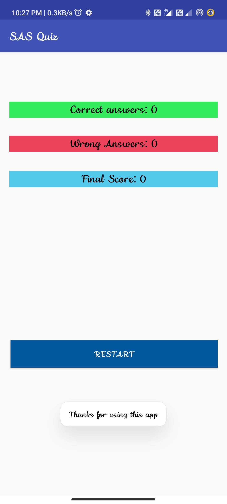
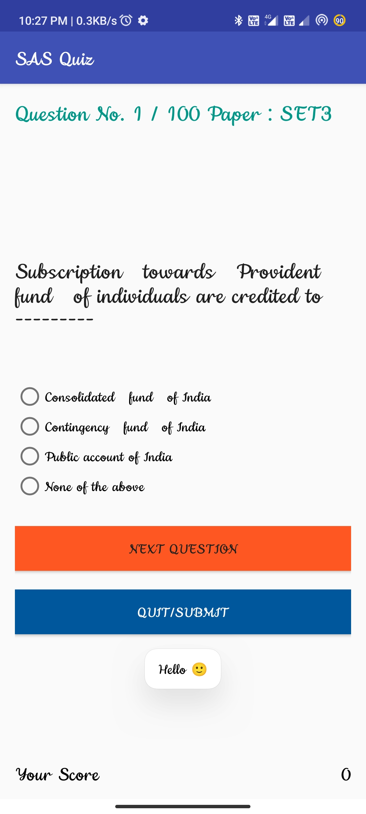
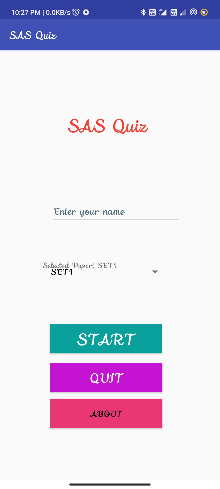
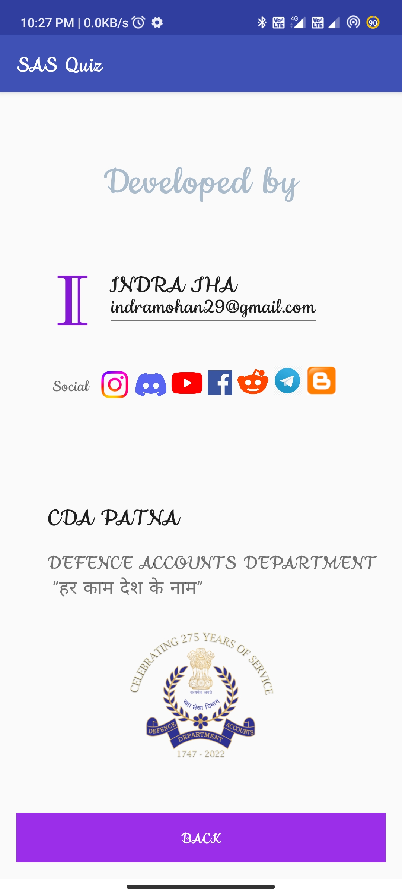

# 📝 SAS Quiz - Android Quiz Application

An Android quiz application built for **SAS (Subordinate Accounts Service)** exam preparation. Features 2,000+ multiple-choice questions across multiple papers, powered by a local Room database for offline access and Firebase Realtime Database for dynamic question updates.

## ✨ Features

- **2,000+ Questions** — Covers Part 1 (17 paper sets), Part 1 Book-wise (18 subjects including Accounts Code, FR, GST, RTI Act, etc.), and Part 2 (OM IX sets)
- **Offline-First** — All core questions are pre-packaged in a SQLite database via Room, so the app works without internet
- **Dynamic Question Sets** — "Latest Questions" are fetched live from Firebase Realtime Database, allowing new sets to be added without updating the APK
- **Secure Google Sign-In** — Unified login using Google Authentication
- **Access Control** — Admin-managed "Whitelisting" via Realtime Database to restrict app access
- **Timed Quiz** — 60-minute countdown timer per quiz session
- **Instant Feedback** — Shows correct/wrong status after each answer
- **Score Tracking** — Displays correct answers, wrong answers, and final score (with negative marking: -¼ per wrong answer)
- **Navigation** — Next/Previous question buttons to review answers

## 🏗️ Architecture

| Component | Technology |
|---|---|
| **Database** | Room (pre-populated from asset) |
| **Remote Data** | Firebase Realtime Database |
| **Authentication** | Firebase Google Sign-In |
| **Image Loading** | Picasso |
| **Min SDK** | 23 (Android 6.0) |
| **Target SDK** | 33 (Android 13) |

## 📂 Project Structure

```
app/src/main/java/com/indrajha/sasquiz/
├── MainActivity.java              # Google Sign-In & Whitelist check
├── WelcomeActivity.java           # Paper selection with category radio buttons
├── QuestionsActivity.java         # Quiz screen (Room database questions)
├── QuestionsCSV_ReadActivity.java # Quiz screen (Firebase questions)
├── ResultActivity.java            # Score display with timer stats
├── DeveloperActivity.java         # About/Developer info
├── AppDatabase.java               # Room database configuration
├── Question.java                  # Room entity (questions table)
├── QuestionDao.java               # Room DAO for database queries
└── DataRepository.java            # Data access layer
```

## 🔥 Firebase Configuration

### 1. Realtime Database (Questions)
```
questions/
├── AccountCode/
│   ├── q1/
│   │   ├── text: "Question text here?"
│   │   ├── answer: "Correct option"
│   │   └── options/
│   │       ├── 0: "Option A"
│   │       ├── 1: "Option B"
│   │       ├── 2: "Option C"
│   │       └── 3: "Option D"
└── <YourNewSet>/      ← Add new nodes here; they appear in-app automatically!
```

### 2. Realtime Database (Whitelist)
To allow a user to log in, add their email to the `allowed_users` node. **Note:** Since Firebase keys cannot contain `.` or `@`, replace them with underscores `_`.
```
allowed_users/
├── indramohan29_gmail_com: true
└── colleague_office_com: true
```

### 3. Google Sign-In Setup
1. Enable **Google** as a Sign-in provider in the Firebase Console.
2. Select a **Support Email** in Project Settings.
3. Add both **Debug** and **Release** SHA-1 fingerprints to your Firebase Project.
4. Download the updated `google-services.json` and place it in the `app/` folder.

## 🚀 Getting Started

### Prerequisites
- Android Studio (Electric Eel or later)
- Java 8+
- A Firebase project with Realtime Database and Google Auth enabled

### Setup
1. Clone the repository:
   ```bash
   git clone https://github.com/IndraMJha/SAS-Quiz.git
   ```
2. Open the project in Android Studio.
3. Add your `google-services.json` file to the `app/` directory.
4. **Build -> Clean Project** to ensure the Web Client ID is correctly generated.
5. Build and run on an emulator or device (min API 23).

## 📸 Screenshots

<p align="center">
  
  
  
  
</p>

## 📄 License

This project is for educational and personal use.

## 👨‍💻 Developer

**Indra Mohan Jha**

